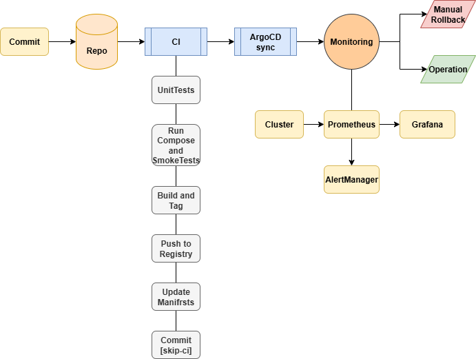
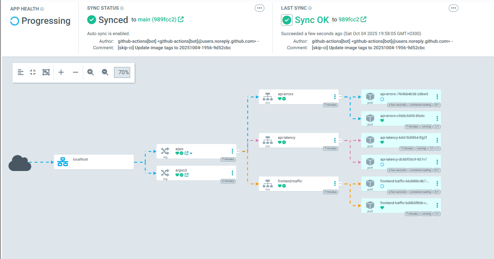
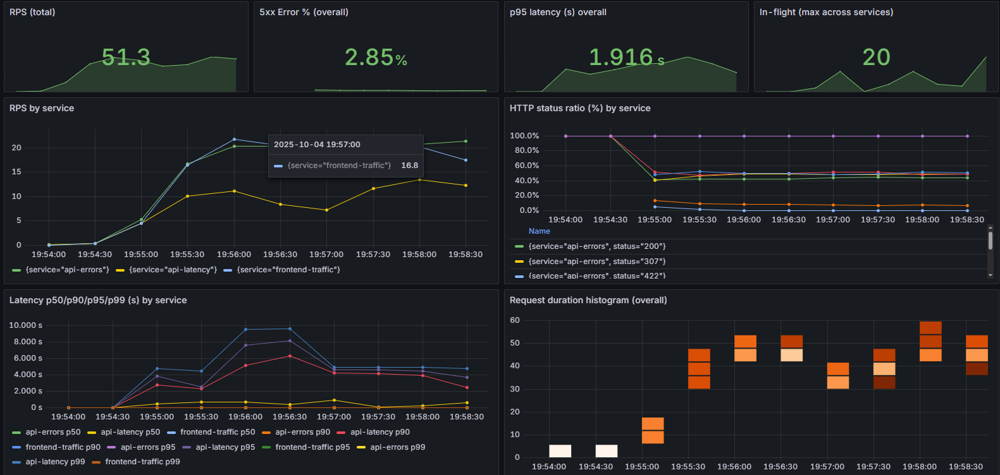
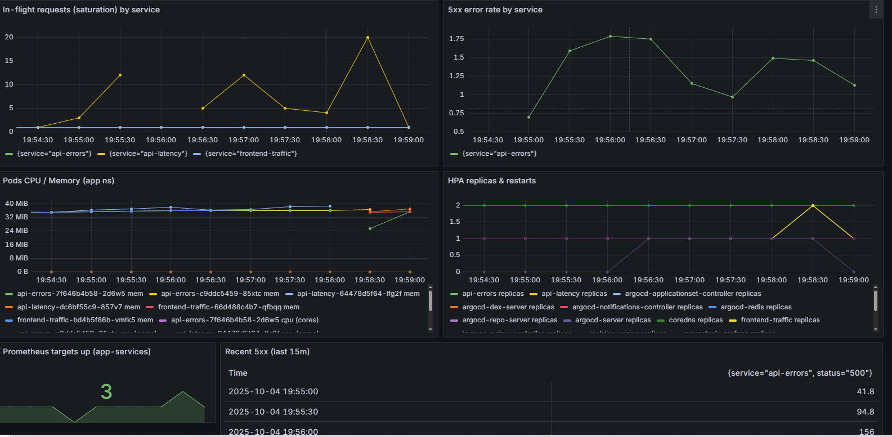

# Monitoring and observability on a K8s Cluster

### [Project idea Page](https://roadmap.sh/projects/simple-monitoring-dashboard)
# Project Overview:
### APPLICATION
- **Three microservices form a simulated production workload**:
  - `frontend-traffic`: drives user request traffic
  - `api-errors`: returns controlled HTTP error responses
  - `api-latency`: emulates variable response delays
  - Each exposes `/metrics` and `/healthz` for telemetry collection, providing data streams for observability
### KUBERNETES CLUSTER
- A modular K8s environment hosting all app and utility workloads
- Includes `metrics-server`, `ingress-nginx`, and `HorizontalPodAutoscalers` for traffic routing, scaling, and resource visibility
- Namespaces segregate app and monitoring components for clean orchestration
### MONITORING & OBSERVABILITY
- Cluster integrated Prometheus + Grafana + Alertmanager stack
- Metrics track Golden Signals: `latency`, `traffic`, `errors`, and `saturation` - visualized in a consolidated Grafana dashboard with alert rules firing via Prometheus and Alertmanager
- Grafana Dashboard includes:
  - **Traffic panels**: Requests Per Second (RPS) per service and overall load
  - **Latency panels**: p50, p90, p95, p99 percentiles across APIs and frontend
  - **Errors panels**: HTTP error rates (5xx) by service and total percentage
  - **Saturation panels**: CPU, memory usage, pod in-flight requests, replica counts
  - **HPA & cluster metrics**: scaling activity, pod restarts, resource health
  - **Prometheus alert views**: active/firing alerts for application and system rules
### CI/CD
- GitOps Driven ArgoCD and GitHub Actions ensures an automated E2E CI/CD Pipeline
- GitHub Actions CI Runs `UnitTests` -- `Docker Compose` and `Smoke Tests` -- `Build, Tag and Push the final image to DockerHub` -- `Updates manifests and commits back to the main Repository on GitHub`
- Tagging scheme: `image-yyymm-hhmm-sha`
- The cluster state remains auto-synced with the repository using ArgoCD, offering visual feedback, version tracking, and hands-free continuous delivery across all components
# Instructions to Run and Test:
- ### [Local Docker-Compose Deployment and Testing](./docs/docker-compose.md)
- ### [Local Manual Docker-Desktop k8s Cluster Deployment](./docs/k8s.md)
- ### [Stress Test for the k8s Cluster](./docs/stress.md)
- ### [Manual Rollback Procedures for the k8s Cluster](./docs/Rollback.md)
- ### [Project Screenshot Validation](./docs/Screenshots.md)
# Project Diagram:

# Grafana Dashboard at Stress and ArgoCD AutoSync:

