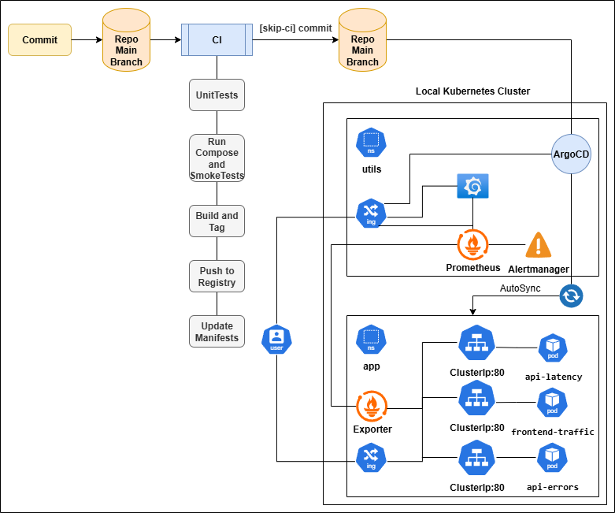

# Monitoring and observability with k8s Cluster Project

### [Project idea Page](https://roadmap.sh/projects/simple-monitoring-dashboard)
This project demonstrates a complete end-to-end observability and 
monitoring stack for Kubernetes, built around the "Golden Signals" 
of latency, traffic, errors, and saturation, It includes everything 
from local Docker testing to full K8s GitOps deployment with Argo CD, 
Prometheus, and Grafana integration
# Project Overview:
---
### APPLICATION OVERVIEW
- Three microservices form a simulated production workload:
  - frontend-traffic: drives user request traffic
  - api-errors: returns controlled HTTP error responses
  - api-latency: emulates variable response delays
  - Each exposes /metrics and /healthz for telemetry collection, providing real data streams for observability validation
---
### KUBERNETES CLUSTER OVERVIEW
- A modular K8s environment hosting all app and utility workloads
- Includes metrics-server, ingress-nginx, and HorizontalPodAutoscalers for traffic routing, scaling, and resource visibility
- Namespaces segregate app and monitoring components for clean orchestration
---
### MONITORING & OBSERVABILITY OVERVIEW
- Integrated Prometheus + Grafana + Alertmanager stack provides end-to-end observability
- Metrics track Golden Signals: latency, traffic, errors, and saturation—visualized in Grafana dashboards with alert rules firing via Prometheus and Alertmanager
- Main Grafana Dashboard includes:
  - Traffic panels: Requests Per Second (RPS) per service and overall load
  - Latency panels: p50, p90, p95, p99 percentiles across APIs and frontend
  - Errors panels: HTTP error rates (4xx / 5xx) by service and total percentage
  - Saturation panels: CPU, memory usage, pod in-flight requests, replica counts
  - HPA & cluster metrics: scaling activity, pod restarts, resource health
  - Prometheus alert views: active/firing alerts for application and system rules
---
### CI/CD OVERVIEW
- GitOps Driven ArgoCD and GitHub Actions ensures an automated E2E CI/CD Pipeline
- GitHub Actions CI Runs UnitTests -- Runs Docker Compose -- Runs Smoke Tests -- Build, Publish,Tag and push the final image to DockerHub -- Updates manifests and commits back
- The cluster state remains synced with the repository using ArgoCD, offering visual feedback, version tracking, and hands-free continuous delivery across all components
---
# Instructions to Run and Test:
- ### [Local Docker-Compose Deployment and testing](./docs/docker-compose.md)
- ### [Local Manual Docker-Desktop k8s Cluster Deployment](./docs/k8s.md)
- ### [Stress Test for the k8s Cluster](./docs/stress.md)
- ### [Manual Rollback Procedures for the k8s Cluster](./docs/Rollback.md)
- ### [Project Screenshot Validation](./docs/Screenshots.md)
# Project Diagram:

